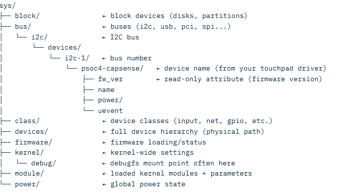

####  Hello World vs Character Device driver – The Key Difference

| Aspect | Hello World Kernel Module | Character Device Driver with Major/Minor Numbers |
| --- | --- | --- |
| Purpose | Demonstrate basic module loading/unloading + printk | Provide an actual interface to communicate with hardware or emulate a device |
| What it does | Prints "Hello world" on insmod, "Goodbye" on rmmod | Registers itself as a device → user programs can open/read/write/ioctl it via /dev/mydev |
| Creates a device node? | No — no /dev/ entry at all | Yes — creates /dev/mydev (or many) with major + minor |
| User space interaction | None (only visible in dmesg) | Full — open(), read(), write(), ioctl(), close() via file operations |
| Major & Minor numbers | Not used / not registered | Explicitly registered (static or dynamic) → identifies the driver and instance |
| Registers with kernel | Only module_init() / module_exit() | Also registers char device (register_chrdev(), cdev_add(), etc.) |
| file_operations struct | Not present | Required — defines .open, .read, .write, .ioctl, etc. |
| Typical visibility | lsmod shows module, dmesg shows messages | /dev/ node appears, ls -l /dev/mydev shows c major,minor |
| Example use case | Learning module basics, debug prints | Serial port, I2C sensor, GPIO, custom hardware, virtual device |
| Code complexity | Very simple (~10 lines) | Much more (~100+ lines minimum) |

####  Quick Summary – The Key Difference

* Hello World module = just a loadable piece of kernel code that prints messages (no user-space device interface)
* Device driver with major/minor = registers as a character device → gets a device file in /dev/ → user-space can actually open/read/write to it → kernel calls your callback functions (.open, .read, etc.) when that happens

The major number basically says "this is handled by my driver", and the minor number says "which specific instance/sub-device" (if the driver supports multiple devices).

sysfs is one of the most important virtual filesystems in the Linux kernel. It is mounted at /sys and acts as a clean, structured interface that lets user-space programs (and you via shell commands) view and sometimes change information about hardware devices, kernel subsystems, drivers, power management, and more — all without needing special tools or recompiling the kernel.

#### Basics of sysfs
/sys is a virtual filesystem (sysfs) mounted in user space.

sysfs is one of the most important virtual filesystems in the Linux kernel. It is mounted at /sys and acts as a clean, structured interface that lets user-space programs (and you via shell commands) view and sometimes change information about hardware devices, kernel subsystems, drivers, power management, and more — all without needing special tools or recompiling the kernel.

Virtual File System means it exists only in Ram and no data is stored on the disk i.e. power goes => the file system goes.

Every time kernel discovers a device (like I2C device - PSOC4 device here), it creates directories and files in /sys. These files usually contain one ASCII value and is easy to read with `cat` and write with `echo`.

#### Main purpose of sysfs
1. To export kernel or device information (like firmware version, driver name etc..) to user space
2. Allow configuration/ control from user space like change brighness , reset device etc..
3. Provide uniform way for tools like udev, systemd, libudev, hwinfo etc..

#### Directory Structure in /sys

#### How sysfs Works Internally (High-Level for Device Drivers)
1. When a driver registers a device using `probe()` function, 
    * it make a `device_register()` function that creates `/sys/devices/...` or `/sys/bus/...`
    * then adds attributes eg: 
    `static DEVICE_ATTR_RO(fw_ver);   // read-only attribute`
    * Each attributes gets a `.show` call back for `cat` system call i.e. read and `store` for `echo` i.e. write.
2. So when ` cat /sys/bus/i2c/devices/i2c-1/psoc4-capsense/fw_ver ` is called, 
    * VFS i.e. sysfs finds the attribute and calls the .show() function
    * Driver reads the values via I2C from PSOC4  Hardware device
    * Formats it as a string and kernel copies it to user space.